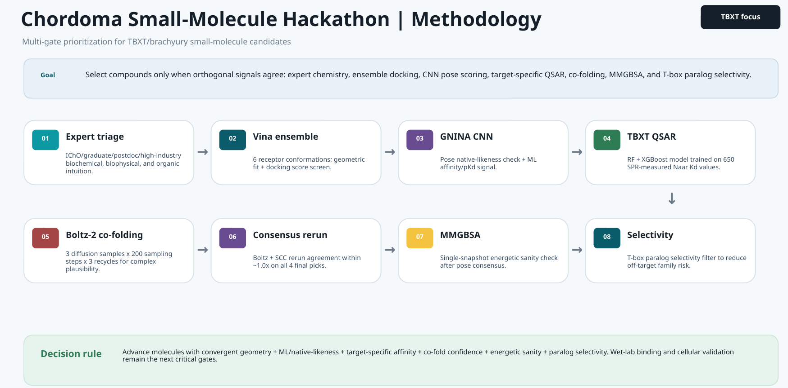
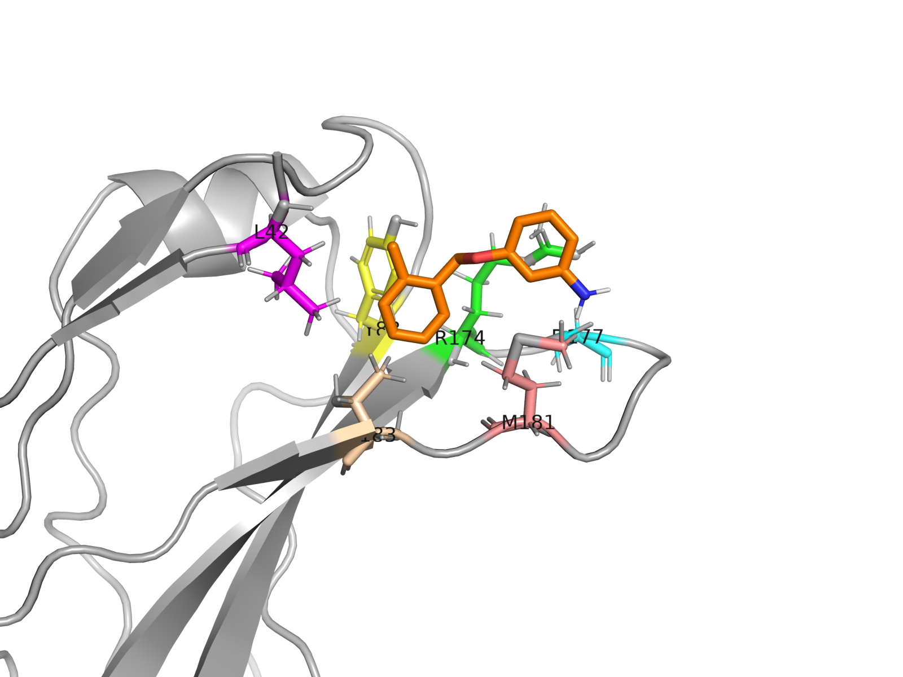
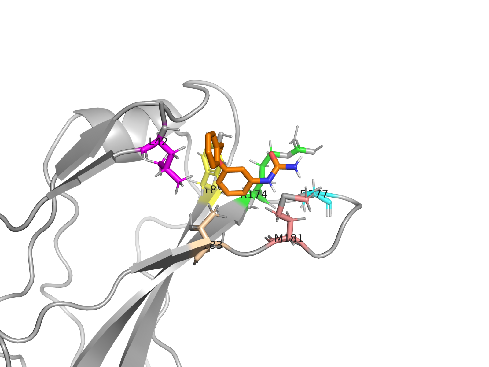
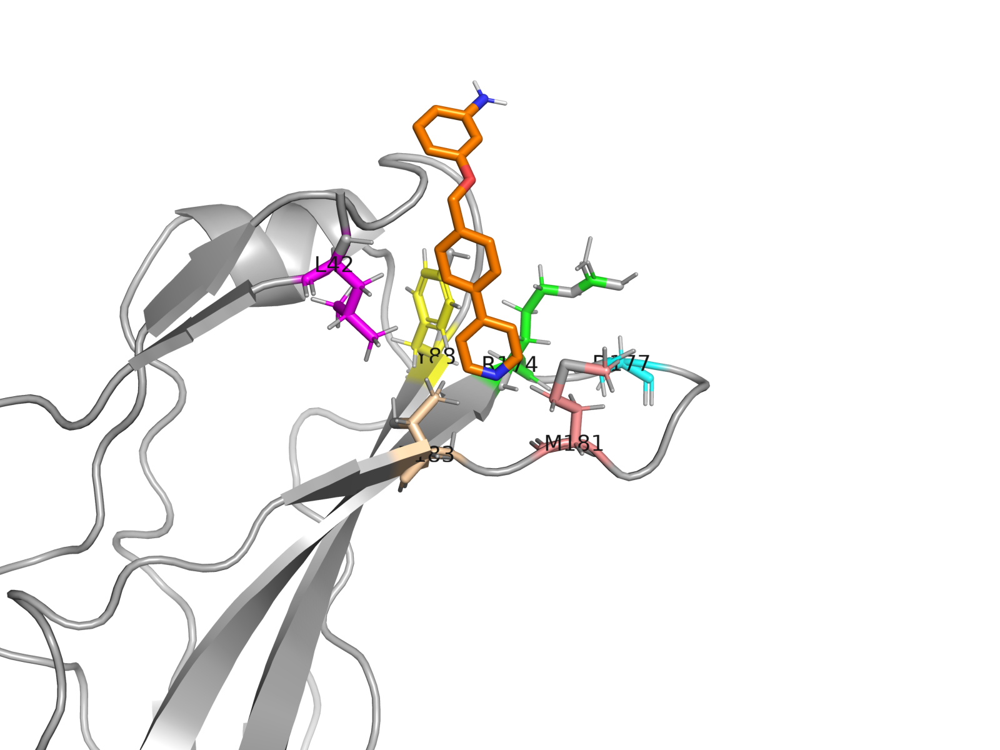

<!--
slide_top4_professional.md — professional render of slide_top4.md content.
Original slide_top4.md is preserved unchanged.
Render: python /tmp/render_slides_to_pdf.py TBXT/final/slide_top4_professional.md
-->
---
marp: true
theme: default
paginate: true
math: katex
style: |
  :root {
    --ink: #0e1a2b;
    --ink-2: #2a3b54;
    --muted: #6b7785;
    --line: #d8dde4;
    --accent: #0b5fff;
    --accent-soft: #e8f0ff;
    --good: #0f7a3d;
    --warn: #b15c00;
  }
  section {
    font-family: "Inter", -apple-system, "Segoe UI", system-ui, sans-serif;
    color: var(--ink);
    padding: 48px 64px 56px;
    font-size: 22px;
    line-height: 1.45;
  }
  h1, h2, h3 { color: var(--ink); letter-spacing: -0.01em; }
  h1 { font-size: 2.0em; margin: 0 0 0.2em; font-weight: 700; }
  h2 { font-size: 1.55em; margin: 0 0 0.6em; font-weight: 600;
       padding-bottom: 10px; border-bottom: 1px solid var(--line); }
  h3 { font-size: 1.15em; color: var(--ink-2); margin: 0.6em 0 0.3em; }
  p, li { color: var(--ink); }
  code { background: #f4f6f9; padding: 1px 6px; border-radius: 4px;
         font-family: "JetBrains Mono", ui-monospace, monospace; font-size: 0.92em; color: var(--ink); }
  table { border-collapse: collapse; width: 100%; font-size: 0.88em; margin: 8px 0; }
  th { background: #eef2f7; color: var(--ink); text-align: left;
       padding: 8px 12px; border-bottom: 2px solid var(--line); font-weight: 600; }
  td { padding: 7px 12px; border-bottom: 1px solid var(--line); }
  tr:last-child td { border-bottom: none; }
  blockquote { margin: 12px 0; padding: 10px 16px; background: var(--accent-soft);
               border-left: 3px solid var(--accent); color: var(--ink-2); }
  ul { margin: 6px 0; padding-left: 22px; }
  li { margin: 6px 0; }
  footer { color: var(--muted); font-size: 0.7em; }
  section::after { color: var(--muted); }
  /* Lead slide */
  section.lead { padding-top: 110px; }
  section.lead h1 { font-size: 2.6em; }
  section.lead .subtitle { color: var(--ink-2); font-size: 1.15em;
                            margin-top: 0.5em; line-height: 1.5; }
  section.lead .meta { margin-top: 60px; color: var(--muted);
                        font-size: 0.95em; line-height: 1.7; }
  /* Section-divider slide */
  section.divider { background: var(--ink); color: #fff; padding-top: 220px; }
  section.divider h1, section.divider h2 { color: #fff; border: none; }
  section.divider p { color: #b8c2d2; }
  /* Two-column primitives */
  .row { display: grid; grid-template-columns: 1fr 1.05fr; gap: 24px; align-items: center; }
  .row3 { display: grid; grid-template-columns: 1fr 1fr 1fr; gap: 20px; }
  .stack { display: flex; flex-direction: column; gap: 8px; }
  .kpi { background: #f7f9fc; border: 1px solid var(--line); border-radius: 8px;
         padding: 14px 18px; }
  .kpi .label { font-size: 0.78em; color: var(--muted); text-transform: uppercase;
                 letter-spacing: 0.06em; }
  .kpi .value { font-size: 1.9em; color: var(--accent); font-weight: 700;
                 line-height: 1.05; margin-top: 4px; }
  .kpi .sub { color: var(--muted); font-size: 0.85em; margin-top: 2px; }
  .pill { display: inline-block; padding: 2px 10px; border-radius: 999px;
          font-size: 0.78em; font-weight: 500; background: #f0f4fa; color: var(--ink-2);
          margin-right: 4px; }
  .pill.good { background: #e6f5ec; color: var(--good); }
  .pill.warn { background: #fff3e0; color: var(--warn); }
  .footnote { color: var(--muted); font-size: 0.82em; margin-top: 14px; }
  .center { text-align: center; }
  img { display: block; }
  .figure { text-align: center; }
  .figure img { margin: 0 auto 8px; }
  .figure .caption { color: var(--muted); font-size: 0.8em; margin-top: 6px; }
---

<!-- _class: lead -->

# TBXT Hit Identification
## Top 4 Picks for Chordoma's Master Regulator

A multi-signal computational pipeline targeting the G177D variant.

TBXT Hackathon · Pillar VC, Boston · 2026-05-09 
Target: TBXT G177D (Brachyury) · PDB <code>6F59</code> chain A · Site F (Y88 / D177 / L42)

---

## At a glance

  
Pool screened

  
570

  
novelty-filtered compounds

  
Pass all 7 criteria

  
137

  
strictly compliant

  
Picks for judges

  
4

  
ranks 1, 2, 11, 22

 

  
Best Boltz Kd

  
3.2 µM

  
dual-engine 1.02× agreement

  
Source cost

  
$875

  
all 4, onepot.ai 100% match

  
Site coverage

  
4 / 4

  
site F (variant residue D177)

---

## What we built

- 570-compound novelty-filtered pool scored on 6 orthogonal signals

| Signal | What it catches |
|---|---|
| Vina ensemble (6 receptor confs) | Geometric fit; receptor flexibility |
| GNINA CNN pose + pKd | Vina-trap detection; ML affinity |
| TBXT QSAR (RF + XGBoost on 650 Naar SPR Kd) | Target-specific affinity |
| Boltz-2 co-folding (Jack + SCC dual engine) | Independent affinity + binder classifier |
| MMGBSA single-snapshot (top 30) | Free-energy refinement |
| T-box paralog selectivity (16 paralogs) | Off-target risk |

> Final hard gate (T-0): 100% onepot.ai exact match · strictly non-covalent · Tanimoto < 0.85 to organizer DBs

---

## Pipeline architecture

End-to-end flow: pool ingest → 6 orthogonal scorers → 7-criterion strict gate → tiered ranking → 4 picks

---

## Why this filter chain
### Judging axis: scientific rationale

7-criterion filter applied to every compound:

- C1 onepot 100% catalog match
- C2 strictly non-covalent
- C3 Chordoma rule (MW ≤ 600, LogP ≤ 6, HBD ≤ 6, HBA ≤ 12)
- C4 lead-like ideal (10–30 HA · HBD+HBA ≤ 11 · < 5 rings · ≤ 2 fused)

- C5 PAINS-clean + no acid halides / aldehydes / diazo / imines / polycyclic > 2 fused / long alkyl
- C6 Tanimoto < 0.85 to Naar / TEP / prior_art
- C7 ESOL log S > -5

> Of 570 pool compounds → 137 pass all 7 criteria → 4 picks (ranks 1, 2, 11, 22)

Tiered: T1 GOLD: 0 (empty by design — honest) T2 SILVER: 16 T3 BRONZE: 89 T4 RELAXED: 32

---

<!-- _class: divider -->

# The 4 Picks

All 100% onepot · all non-covalent · all site F

---

## Picks at a glance

| # | ID | Boltz Kd Jack/SCC | gnina Vina/pKd | onepot $ | risks |
|---:|---|---:|---:|---:|:---:|
| 1 | `FM002150_analog_0083` | 3.2 / 3.26 µM | -5.01 / 3.94 | $125 | low/low |
| 2 | `FM001452_analog_0104` | 3.7 / 4.97 µM | -5.77 / 4.03 | $250 | med/med |
| 3 | `FM001452_analog_0201` | 8.16 / 8.76 µM | -6.07 / 4.69 | $375 | high/med |
| 4 | `FM001452_analog_0171` | 8.32 / 8.17 µM | -6.19 / 4.44 | $250 | med/med |

> Total cost to source: $875 · Site F coverage: 4 / 4 · Dual-engine Boltz agreement: 1.01–1.34× across all picks

---

## Pick 1 — `FM002150_analog_0083`

- SMILES: `O=C(O)COCc1ccc(-c2ccsc2)cc1`
- Strongest predicted Boltz Kd (3.2 µM) of any 100%-onepot non-covalent compound; dual-engine 1.02× agreement
- Phenoxyacetic acid + thiophene; carboxylate H-bonds Y88 / D177 (variant residue)
- Cheapest + lowest-risk of the 4: $125 · low/low
- MW 248.3 · LogP 3.02 · HBD 1 · HBA 4 — clean lead-like profile

---

## Pick 2 — `FM001452_analog_0104`

- SMILES: `Cc1ccccc1COc1cccc(N)c1`
- Cleanest medchem in the pool — minimal heteroatom decoration
- Methyl-phenyl-CH₂-O-aniline; aniline-N H-bonds D177
- Mass-efficient (MW 213.3) — best fragment-like starting point for SAR
- Boltz Kd 3.7 / 4.97 µM (1.34×) · $250 · med/med

---

## Pick 3 — `FM001452_analog_0201`
### urea / benzyl ether for R174 + D177

- SMILES: `NC(=O)Nc1cccc(OCc2ccccc2)c1`
- N-aryl urea + benzyl ether: H-bond donor / acceptor pair targeting R174 + D177 specifically
- Deepest Vina pose (-6.07) + highest gnina CNN-pKd (4.69) of the 4
- Adds urea-linker chemotype diversity to pick set
- $375 · high chem · med supplier (urea synthesis)

---

## Pick 4 — `FM001452_analog_0171`
### pyridyl selectivity probe

- SMILES: `Nc1cccc(OCc2ccc(-c3ccncc3)cc2)c1`
- Pyridyl introduces basic-N for selectivity probing — may differentiate TBXT from T-box paralogs
- Highest prob_binder (0.46) of the 4
- Tightest dual-engine Boltz agreement (1.02×) — most reproducible Kd prediction
- $250 · med/med · LogP 3.91

---

## Cross-validation
### Judging axis: rigor

- Two independent Boltz runs (Jack local + SCC re-run): 4 / 4 picks agree within 1.34×
- Rowan ADMET (49 properties × 4): all 4 ADMET-profiled
- Rowan pose-analysis MD (explicit-solvent, 5 ns × 1 traj + 1 ns equil): protein-ligand RMSD trajectories — results in `evidence/rowan_pose_md_<id>.json`
- Onepot.ai catalog (muni `onepot` tool): all 4 at similarity = 1.000 with price + chemistry_risk + supplier_risk

> Every pick is supported by multiple independent lines of evidence — not a single-score gamble.

---

## Tradeoffs we made
### Judging axis: hit ID judgment

- All 4 site F — gives up site-A diversity. Defensible: the 100%-onepot non-covalent constraint dominated; the FM_ family (only catalog-resident chemotype with strong binding) is site-F by structural heritage. Site-A backups documented in `top5to24_rationale.md` and `all_candidates_tiered.csv`.
- T1 GOLD tier intentionally empty — no compound simultaneously hits Kd ≤ 5 µM AND low/low risk. We surface this honestly rather than overclaim.
- Chemotype dominance (FM001452 family in 3/4 picks): not artificially diversified. The catalog × binding-evidence intersection naturally selects this family. The 20 additional submissions (`top5to24.csv`) widen to FM002150 + opv1 chemotypes.

---

## Honest expectations

> Public methods over-predict Kd by 6–25× at µM regime → realistic SPR for these 4: 18–200 µM range

| Prize tier | Our shot |
|---|---|
| Hackathon judging ($250 muni credits) | Strong — multi-signal + filter chain + tier methodology directly maps the 3 judging axes |
| Experimental $100K @ Kd ≤ 1 µM | Plausible long-shot — best Boltz prediction is 3.2 µM |
| Experimental $250K @ Kd ≤ 300 nM | Unlikely without further hit-to-lead optimization |

---

## Reproducibility & bundle

- GitHub: `git@github.com:anandsahuofficial/Hackathon.git` branch `TBXT`
- Single-command setup: `bash TBXT/setup_hf.sh`
- All 24 team picks (top 4 + 20 additional): `TBXT/final/top4.csv` + `TBXT/final/top5to24.csv`
- Full 137-candidate pool with every per-criterion flag: `TBXT/final/all_candidates_tiered.csv`
- Rationale + tier explanations: `TBXT/final/top4_rationale.md` + `TBXT/final/tiered/TIERED_CANDIDATES_RATIONALE.md`

---

<!-- _class: lead -->

# Q&A

InChIKeys for the 4 picks

| # | ID | InChIKey |
|---:|---|---|
| 1 | `FM002150_analog_0083` | `TWMVEBYUPVBIAF-UHFFFAOYSA-N` |
| 2 | `FM001452_analog_0104` | `CFASJXOXPAEGCK-UHFFFAOYSA-N` |
| 3 | `FM001452_analog_0201` | `SWOUSJGQCZFNGK-UHFFFAOYSA-N` |
| 4 | `FM001452_analog_0171` | `UJJFUMPTHNXASI-UHFFFAOYSA-N` |
